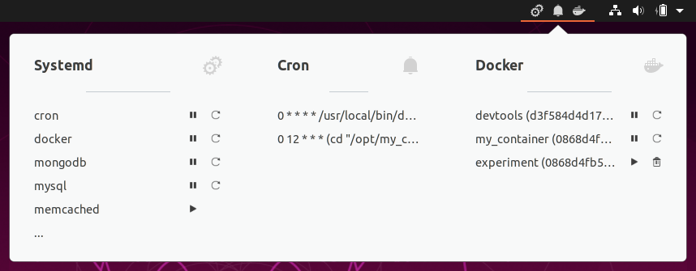
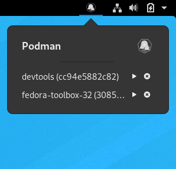
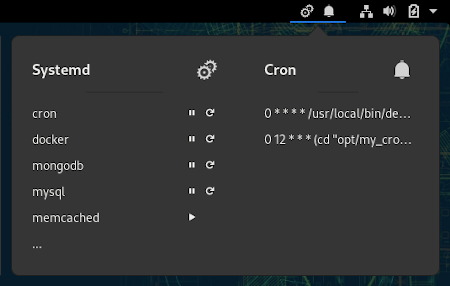

# SerMon: Service Monitor

A GNOME Shell extension for monitoring and managing systemd services, cron jobs, docker and poman containers.

You can configure it to show only the information you are interested in (e.g. only systemd services and/or docker containers).

Published at: https://extensions.gnome.org/extension/1804/sermon/

[](https://travis-ci.org/rovellipaolo/gnome-shell-extension-sermon)
[](https://lgtm.com/projects/g/rovellipaolo/gnome-shell-extension-sermon/context:javascript)
[](https://img.shields.io/badge/License-GPL%20v2-blue.svg)







## Branches and GNOME Shell versions

The `master` branch includes all stable features and currently supports GNOME Shell _3.34_, _3.36_ and _3.38_.
Among others, these versions of GNOME Shell are used in the following Linux distributions:
* Fedora 31, 32 and 33
* Manjaro 19.0, 20.0 and 20.1
* openSUSE Leap 15.2
* Pop!_OS 19.10, 20.04 LTS and Pop!_OS 20.10
* SUSE Linux Enterprise Desktop 15 SP2
* Ubuntu 19.10 (Eoan Ermine), 20.04 LTS (Focal Fossa) and Ubuntu 20.10 (Groovy Gorilla)

The `gnome-shell-3-28` branch is a backport of most of the new features to GNOME Shell _3.26_, _3.28_ and _3.30_.
Among others, these versions of GNOME Shell are used in the following Linux distributions:
* CentOS 7.7-1908 and 8.0-1905
* Debian 10 (Buster)
* Fedora 27, 28 and 29
* openSUSE Leap 15.0 and 15.1
* Pop!_OS 18.04 LTS and 18.10
* Red Hat Enterprise Linux 7.7 (Maipo) and 8.0 (Ootpa)
* SUSE Linux Enterprise Desktop 15
* Ubuntu 18.04 LTS (Bionic Beaver) and 18.10 (Cosmic Cuttlefish)


## Building and Installing

To clone the repository execute:
```shell
$ git clone https://github.com/rovellipaolo/gnome-shell-extension-sermon
$ cd gnome-shell-extension-sermon
```

To build the extension execute:
```shell
$ make build
```
**NOTE:** This will create a zip archive named `sermon@rovellipaolo-gmail.com.shell-extension.zip`.

To install the extension execute:
```shell
$ make install
```
**NOTE:** This will unzip the previously builded zip archive into `~/.local/share/gnome-shell/extensions/sermon@rovellipaolo-gmail.com`.

Afterwards, restart GNOME Shell: press `Alt`+`F2`, type `r` and press enter.

Finally, if not already done, enable the extension at: [https://extensions.gnome.org](https://extensions.gnome.org/local)
Or, alternatively, to enable the extension execute:
```shell
$ make enable
```
While to disable the extension execute:
```shell
$ make disable
```

## Configuring

See existing settings at: https://extensions.gnome.org/local/


To change the settings go to: `org.gnome.shell.extensions.sermon.gschema.xml`
And then execute:
```shell
$ make build-settings
```

## Running Checkstyle & Tests

To run the checkstyle execute:
```shell
$ make checkstyle
```
**NOTE:** This is using [`eslint`](https://github.com/eslint/eslint) and [`prettier`](https://github.com/prettier/prettier) under-the-hood.

You can also run the checkstyle automatically at every git commit by launching the following command:
```
$ make install-githooks
```

To run the tests execute:
```shell
$ make test

...

Container.isInstalled()
  ✔ when container engine is found, returns true
  ✔ when container engine is not found, returns false

Container.getContainers()
  ✔ when retrieving the containers, container engine ps command is executed

Container.parseContainers()
  ✔ when pasing command execution result with containers, returns a list of containers
  ✔ when pasing command execution result without containers, returns an empty list

Container.filterContainers()
  ✔ returns the list of containers ordered by status
  ✔ when no container is passed, returns an empty list

Container.startContainer()
  ✔ when starting a container, container engine start command is executed

Container.stopContainer()
  ✔ when stopping a Docker container, container engine stop command is executed

Container.restartContainer()
  ✔ when restarting a Docker container, container engine restart command is executed

Container.removeContainer()
  ✔ when removing a Docker container, container engine rm command is executed

...

MenuPresenter()
  ✔ when initialized, there is no event in the menu
  ✔ when initialized, there is no section in the menu
  ✔ when initialized, the active sections are retrieved
  ✔ when initialized, the icon in shown in the menu

MenuPresenter.onClick()
  ✔ when clicking on the menu and this is already open, no operation is performed
  ✔ when clicking on the menu and this opens, the active sections are refreshed
  ✔ when clicking on the menu and this opens, the menu is cleared and then shown again

MenuPresenter.setupEvents()
  ✔ when setting up the menu events, a click event is added to the menu

MenuPresenter.setupView()
  ✔ when setting up the menu, this is cleared and then shown
  ✔ when setting up the menu, the section container is shown in the menu
  ✔ when setting up the menu and Systemd is not enabled, its section is not shown
  ✔ when setting up the menu and Systemd is enabled, its section is shown in first position
  ✔ when setting up the menu and Cron is not enabled, its section is not shown
  ✔ when setting up the menu and both Systemd and Cron are enabled, Cron section is shown in the menu in second position
  ✔ when setting up the menu and only Cron is enabled, Cron section is shown in the menu in first position
  ✔ when setting up the menu and Docker is not enabled, its section is not shown
  ✔ when setting up the menu and all sections are enabled, Docker section is shown in the menu in third position
  ✔ when setting up the menu and both Systemd and Docker are enabled, Docker section is shown in the menu in second position
  ✔ when setting up the menu and only Docker is enabled, Docker section is shown in the menu in first position

MenuPresenter.onDestroy()
  ✔ when destroyed and without events, no operation is performed
  ✔ when destroyed and with events, all events are removed from the menu
  ✔ when destroyed and without views, no operation is performed
  ✔ when destroyed and with views, all views are removed from the menu

...

✔ 421 completed
```
**NOTE:** This is using [`gjsunit`](https://github.com/philipphoffmann/gjsunit) under-the-hood.


## Debugging

To show GNOME Shell logs execute:
```shell
$ make show-logs

[SerMon] DEBUG (MenuPresenter) On click menu
[SerMon] DEBUG (MenuPresenter) Refreshing menu...
[SerMon] DEBUG (MenuPresenter) Rendering menu...
[SerMon] DEBUG (CommandLine) Executing: "systemctl list-units --type=service --all"
[SerMon] DEBUG (CommandLine) Output: ...
[SerMon] INFO (SectionContainerPresenter) Add section: "Systemd"
[SerMon] DEBUG (CommandLine) Executing: "crontab -l"
[SerMon] DEBUG (CommandLine) Output: ...
[SerMon] INFO (SectionContainerPresenter) Add section: "Cron"
[SerMon] DEBUG (CommandLine) Executing: "docker ps -a --format '{{.ID}} | {{.Status}} | {{.Names}}'"
[SerMon] DEBUG (CommandLine) Output: ...
[SerMon] INFO (SectionContainerPresenter) Add section: "Docker"
[SerMon] DEBUG (CommandLine) Executing: "docker ps -a --format '{{.ID}} | {{.Image}} | {{.Status}} | {{.Names}}'"
[SerMon] DEBUG (CommandLine) Output: ...
[SerMon] INFO (SectionPresenter) Add item: "cron"
[SerMon] INFO (SectionPresenter) Add item: "docker"
[SerMon] INFO (SectionPresenter) Add item: "memcached"
[SerMon] INFO (SectionPresenter) Add item: "mysql"
[SerMon] INFO (SectionPresenter) Add item: "..."
[SerMon] INFO (SectionPresenter) Add item: "0 * * * * /usr/local/bin/my_cron_script"
[SerMon] INFO (SectionPresenter) Add item: "0 12 * * * (cd \"/opt/my_cron_repo\"; HOME= git pull)"
[SerMon] INFO (SectionPresenter) Add item: "my_docker (123456789abc)"
[SerMon] DEBUG (ClickableSectionItemPresenter) On mouse over: "my_docker (123456789abc)"
[SerMon] DEBUG (ClickableSectionItemPresenter) On click: "my_docker (123456789abc)"
[SerMon] DEBUG (CommandLine) Executing: "docker stop 123456789abc"
[SerMon] INFO (DockerRepository) Docker container "123456789abc" stopped correctly!
[SerMon] DEBUG (MenuPresenter) Rendering menu...
```
